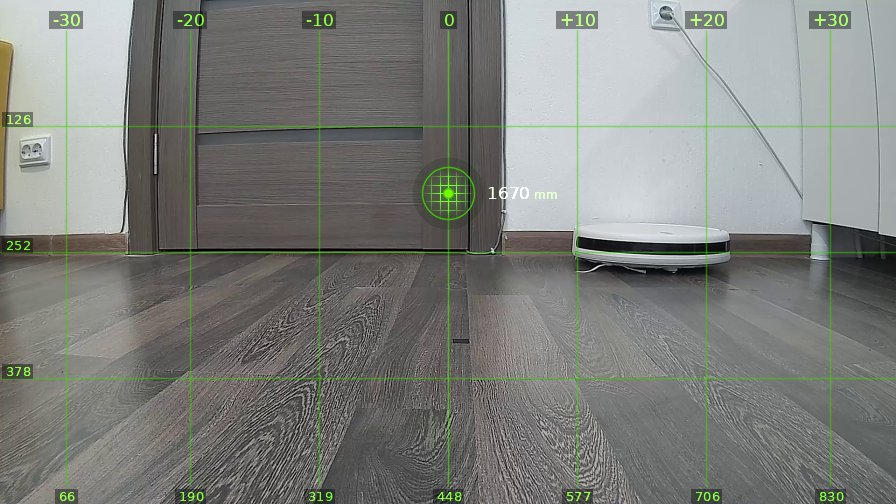
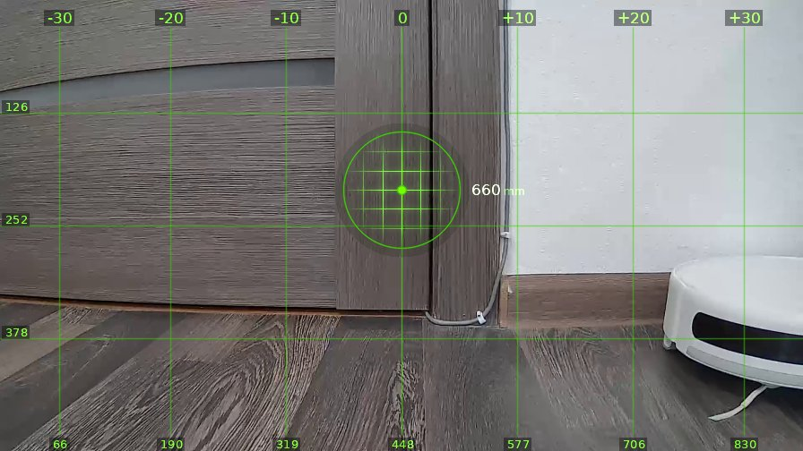
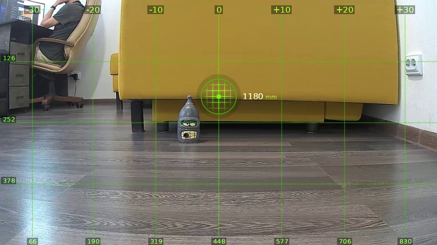

# brain_20260520_170729-opus

| | |
|---|---|
| **Дата** | 20 мая 2026, 17:07 |
| **Модель** | `claude-opus-4-7` |
| **Температура** | дефолт провайдера |
| **Задача** | На каждом шаге описывай что видишь. Проедь вперёд один метр, затем поверни налево на 90 градусов. |
| **Инструменты** | `move` · `turn_relative` · `stop` · `done` |
| **Итого** | 3 витков, 1 мин 5 с, 12.5k токенов |

---

## Виток 1

**Ход 1 | дальномер=1670мм | батарея=11.3В | подсветка: красный=выкл синий=выкл**

> Вижу дверь шкафа прямо по курсу, справа кожаный мешок прикупил себе робот-пылесос, конкурент мой, мать его. Полтора метра свободного пространства, можно ехать.

*↑ 3170 вх. / ↓ 137 исх. токенов*

**→ `move`** (1.0 м)

← `ok`, проехал 1050 мм

---

## Виток 2

**Ход 2 | дальномер=660мм | батарея=11.4В | подсветка: красный=выкл синий=выкл**

> Подъехал почти вплотную к шкафу, 660мм до двери. Теперь крутим налево, как заказывали, кожаный.

*↑ 4025 вх. / ↓ 115 исх. токенов*

**→ `turn_relative`** (↺ 90°)

← `ok`

---

## Виток 3

**Ход 3 | дальномер=1180мм | батарея=11.4В | подсветка: красный=выкл синий=выкл**

> Развернулся. Передо мной жёлтый диван, под ним притаился Бендер — единственный нормальный чувак в этой комнате. Слева в кресле сидит кожаный мешок и пялится в экран, как обычно. Задача выполнена, тысяча чертей.

*↑ 4851 вх. / ↓ 158 исх. токенов*

**→ `done`**

> ✅ Готово
