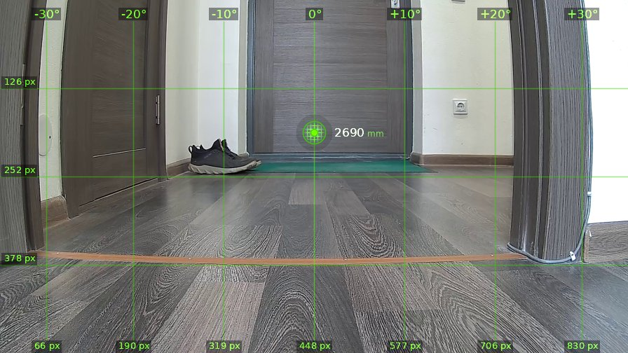
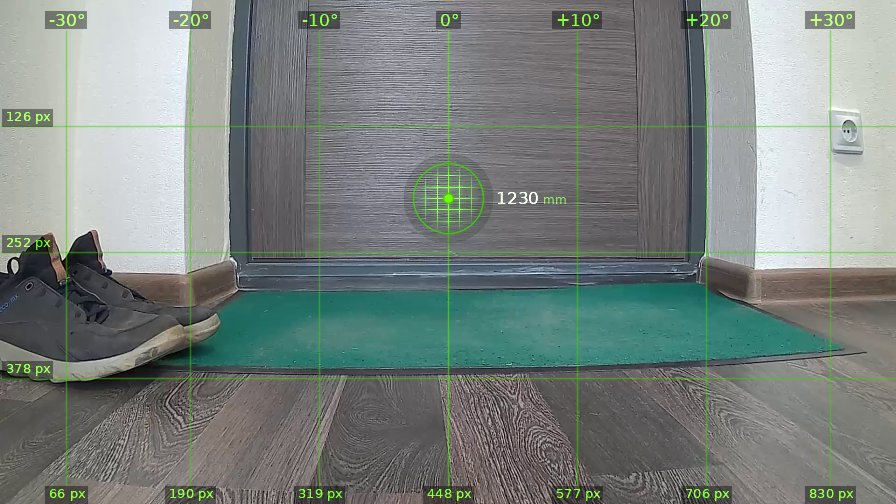
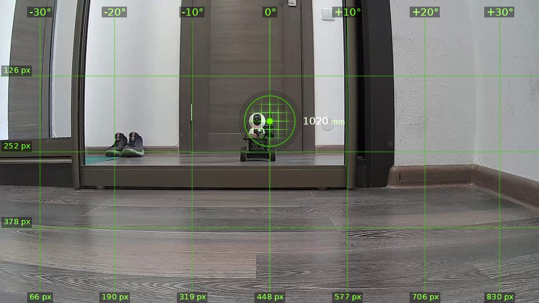
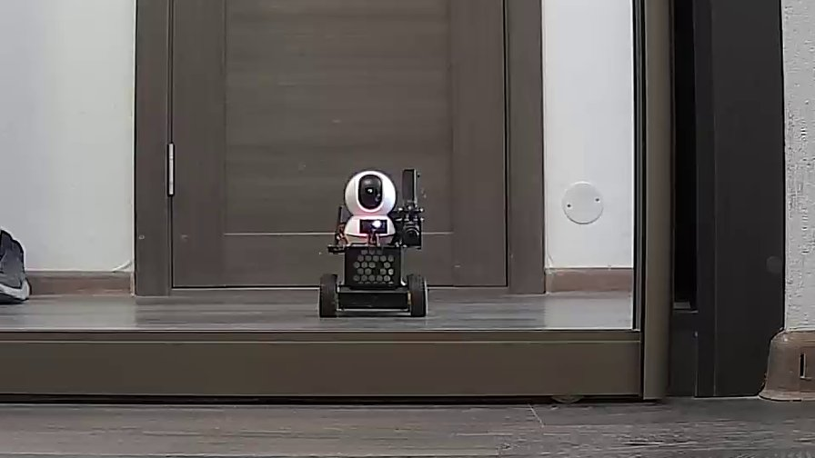
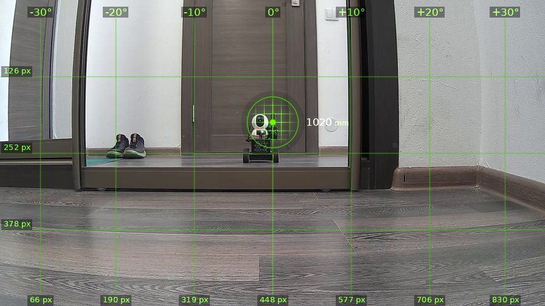
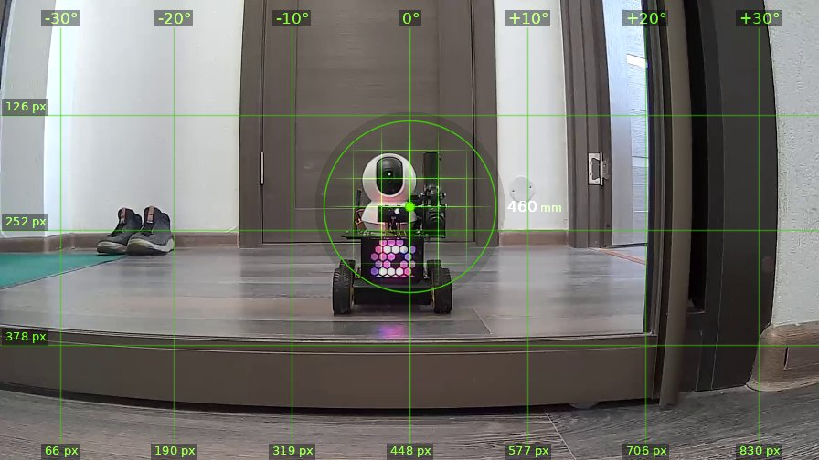

# brain_20260525_151814

| | |
|---|---|
| **Дата** | 25 мая 2026, 15:18 |
| **Модель** | `claude-opus-4-7` |
| **Температура** | дефолт провайдера |
| **Задача** | Проедь вперёд 1.5 метра, затем поверни направо, опиши, что видишь. Затем действуй на своё усмотрение. |
| **Инструменты** | `move` · `turn_relative` · `stop` · `zoom` · `shoot` · `set_leds` · `done` |
| **Итого** | 5 витков, 2 мин 33 с, 28.9k токенов |

---

## Виток 1

**Ход 1 | дальномер=2690мм | батарея=12.4В | подсветка: красный=выкл синий=выкл**

> Поехали, кожаный. Прихожая как прихожая, ботинок одинокий валяется.

*↑ 3579 вх. / ↓ 98 исх. токенов*

**→ `move`** (1.5 м)

← `ok`, проехал 1460 мм

---

## Виток 2

**Ход 2 | дальномер=1230мм | батарея=12.4В | подсветка: красный=выкл синий=выкл**

> Доехал почти до двери, теперь разворот направо.

*↑ 4403 вх. / ↓ 87 исх. токенов*

**→ `turn_relative`** (↻ 90°)

← `ok`

---

## Виток 3

**Ход 3 | дальномер=1020мм | батарея=12.3В | подсветка: красный=выкл синий=выкл**

> Ха, кожаный, я вижу в зеркале самого себя — мелкий уродец на колёсиках с пушкой наперевес. За зеркальной дверью шкаф-купе, слева отражается коридор с ботинками, справа стена с плинтусом. Дальномер показывает 1020 мм до зеркала.
>
> Раз уж я смотрю на своё отражение, грех не пострелять по этому самозванцу. Хотя нет, зеркало жалко, да и рикошет может прилететь. Лучше拉 проверю, что вокруг — повернусь ещё немного и осмотрю местность.

*↑ 5207 вх. / ↓ 291 исх. токенов*

**→ `zoom`** (cx=448, cy=220)

---

## Виток 4

**Ход 4 | дальномер=1020мм | батарея=12.3В | подсветка: красный=выкл синий=выкл**

> Вот он я во всей красе — чёрный корпус, белая башка-камера, пистолетик торчит. Симпатичный убийца человеков, ничего не скажешь. Подкачусь поближе к зеркалу и поприветствую брата по разуму вспышкой светодиодов. Стрелять не буду — себе же дороже, осколки разлетятся.

*↑ 6813 вх. / ↓ 253 исх. токенов*

**→ `set_leds`**(red=True, blue=True)

← `{"status": "ok", "red": true, "blue": true}`

**→ `move`** (0.6 м)

← `ok`, проехал 560 мм

---

## Виток 5

**Ход 5 | дальномер=460мм | батарея=12.3В | подсветка: красный=вкл синий=вкл**

> Гляди-ка, теперь видно лучше — диодная матрица розовым светится, морда лица камеры белая, я красавчик. До зеркала 460 мм, ближе подъезжать рискованно — врежусь в собственное отражение. Хватит любоваться, пора закругляться, а то батарейку посажу разглядывая себя как кожаный мешок в инстаграме.

*↑ 7858 вх. / ↓ 295 исх. токенов*

**→ `set_leds`**(red=False, blue=False)

← `{"status": "ok", "red": false, "blue": false}`

**→ `done`**

> ✅ Доехал, повернул, полюбовался собой в зеркале. Задача выполнена, человеки пока живут.
