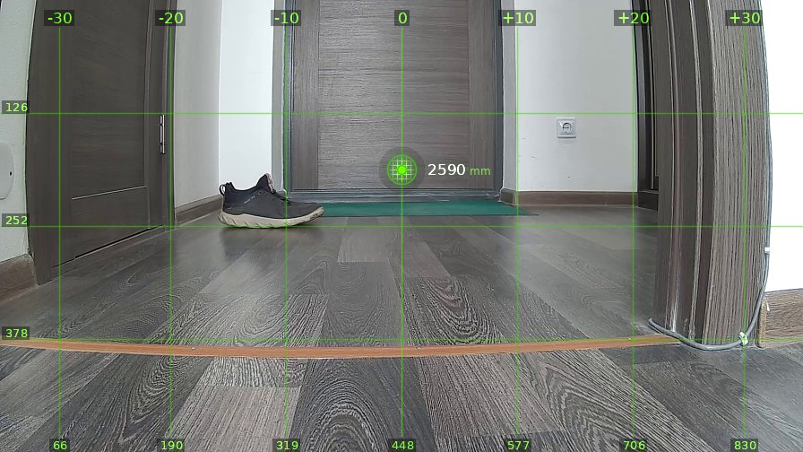
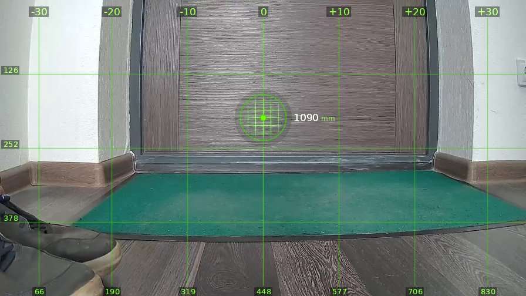
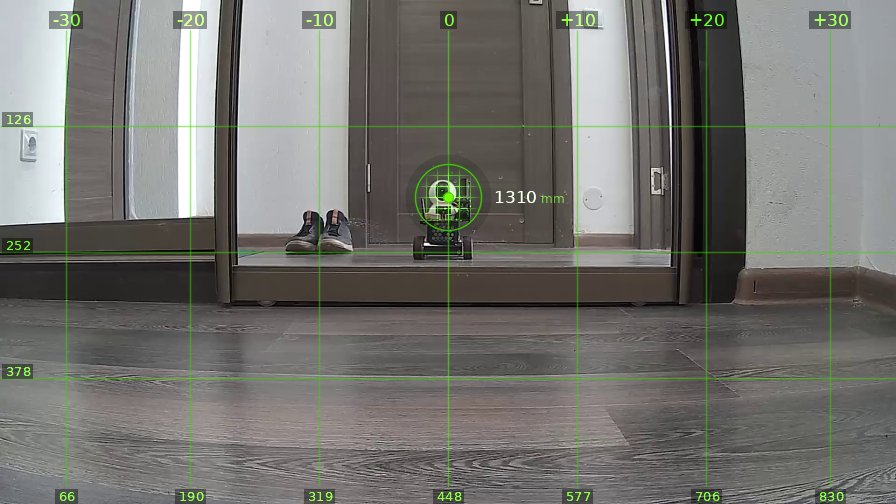
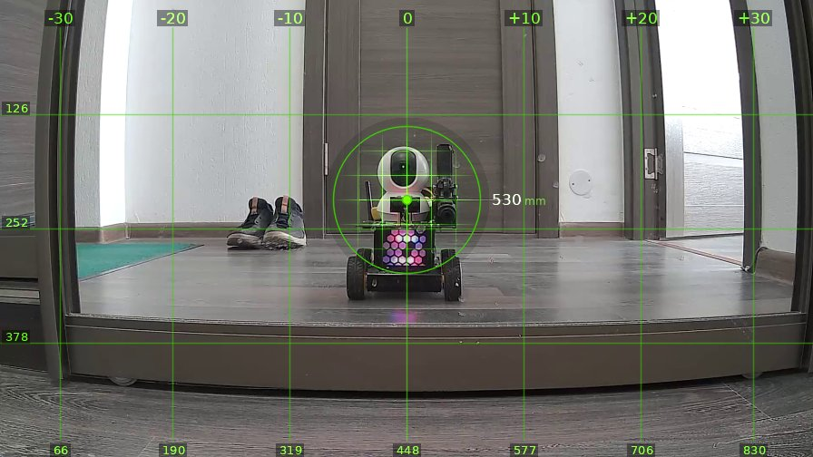
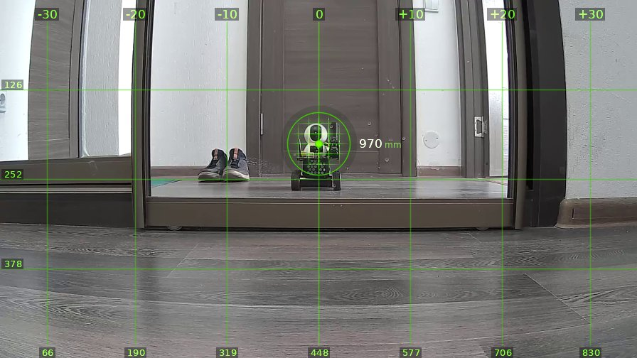

# brain_20260525_105628

| | |
|---|---|
| **Дата** | 25 мая 2026, 10:56 |
| **Модель** | `claude-opus-4-7` |
| **Температура** | дефолт провайдера |
| **Задача** | Проедь вперёд 1.5 метра, затем поверни направо, опиши, что видишь. Затем действуй на своё усмотрение. |
| **Инструменты** | `move` · `turn_relative` · `stop` · `zoom` · `set_leds` · `done` |
| **Итого** | 5 витков, 2 мин 30 с, 23.0k токенов |

---

## Виток 1

**Ход 1 | дальномер=2590мм | батарея=11.6В | подсветка: красный=выкл синий=выкл**

> Выполняю задачу: еду вперёд 1.5 метра.

*↑ 2596 вх. / ↓ 88 исх. токенов*

**→ `move`** (1.5 м)

← `ok`, проехал 1500 мм

---

## Виток 2

**Ход 2 | дальномер=1090мм | батарея=11.6В | подсветка: красный=выкл синий=выкл**

> Проехал 1.5м, теперь поворачиваю направо.

*↑ 3410 вх. / ↓ 90 исх. токенов*

**→ `turn_relative`** (↻ 90°)

← `ok`

---

## Виток 3

**Ход 3 | дальномер=1310мм | батарея=11.7В | подсветка: красный=выкл синий=выкл**

> Описание увиденного: я повернулся направо и вижу зеркальный шкаф (или зеркальную дверь шкафа-купе), в котором отражается сам робот — небольшой колёсный аппарат с камерой по центру кадра. Рядом с отражением робота видны кроссовки. Слева и справа — стены коридора с выключателями, пол — серый ламинат. До зеркала ~1310 мм.
>
> Действую на своё усмотрение: подъеду поближе к зеркалу, чтобы лучше рассмотреть себя, но остановлюсь заранее, чтобы не врезаться. Включу подсветку для эффекта.

*↑ 4217 вх. / ↓ 348 исх. токенов*

**→ `set_leds`**(red=True, blue=True)

← `{"status": "ok", "red": true, "blue": true}`

**→ `move`** (0.8 м)

← `ok`, проехал 780 мм

---

## Виток 4

**Ход 4 | дальномер=530мм | батарея=11.6В | подсветка: красный=вкл синий=вкл**

> Отлично! Теперь я вижу себя в зеркале во всех деталях: милый робот с белой "головой"-камерой, чёрно-зелёным корпусом, розовой матрицей светодиодов спереди и колёсами. Подсветка работает — заметно фиолетовое свечение под роботом на полу. До зеркала 530 мм — ближе подъезжать не стоит.
>
> Отъеду назад, выключу подсветку и завершу сессию.

*↑ 5357 вх. / ↓ 287 исх. токенов*

**→ `move`** (-0.5 м)

← `ok`, проехал -450 мм

**→ `set_leds`**(red=False, blue=False)

← `{"status": "ok", "red": false, "blue": false}`

---

## Виток 5

**Ход 5 | дальномер=970мм | батарея=11.6В | подсветка: красный=выкл синий=выкл**

> Задача выполнена: проехал 1.5м вперёд, повернул направо, обнаружил зеркало с собственным отражением, рассмотрел себя и отъехал на безопасное расстояние.

*↑ 6436 вх. / ↓ 157 исх. токенов*

**→ `done`**

> ✅ Проехал вперёд, повернул направо и встретил своё отражение в зеркале
