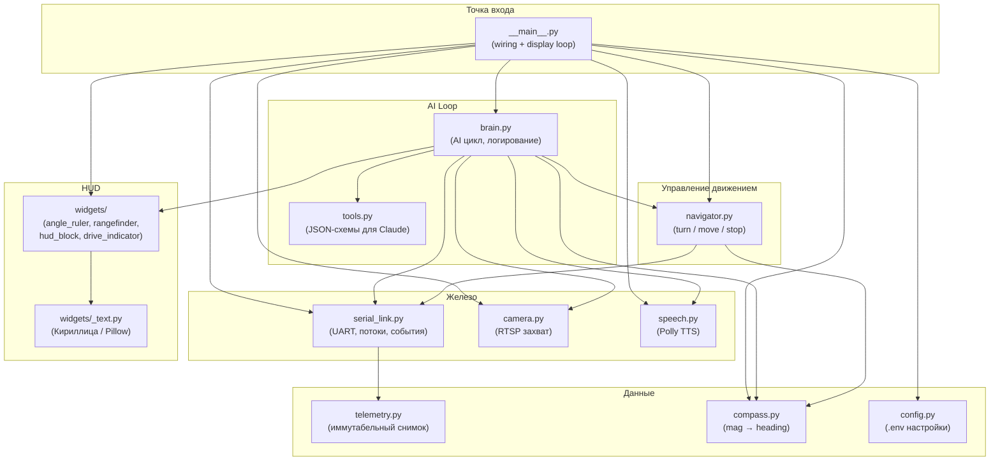

```mermaid
graph TD
    subgraph entry["Точка входа"]
        main["__main__.py\n(wiring + display loop)"]
    end

    subgraph core["AI Loop"]
        brain["brain.py\n(AI цикл, логирование)"]
        tools["tools.py\n(JSON-схемы для Claude)"]
    end

    subgraph motion["Управление движением"]
        navigator["navigator.py\n(turn / move / stop)"]
    end

    subgraph hw["Железо"]
        serial_link["serial_link.py\n(UART, потоки, события)"]
        camera["camera.py\n(RTSP захват)"]
        speech["speech.py\n(Polly TTS)"]
    end

    subgraph data["Данные"]
        telemetry["telemetry.py\n(иммутабельный снимок)"]
        compass["compass.py\n(mag → heading)"]
        config["config.py\n(.env настройки)"]
    end

    subgraph ui["HUD"]
        widgets["widgets/\n(angle_ruler, rangefinder,\nhud_block, drive_indicator)"]
        text["widgets/_text.py\n(Кириллица / Pillow)"]
    end

    main --> brain
    main --> navigator
    main --> camera
    main --> serial_link
    main --> speech
    main --> compass
    main --> config
    main --> widgets

    brain --> navigator
    brain --> camera
    brain --> serial_link
    brain --> speech
    brain --> compass
    brain --> tools
    brain --> widgets

    navigator --> serial_link
    navigator --> compass

    serial_link --> telemetry

    widgets --> text
```
